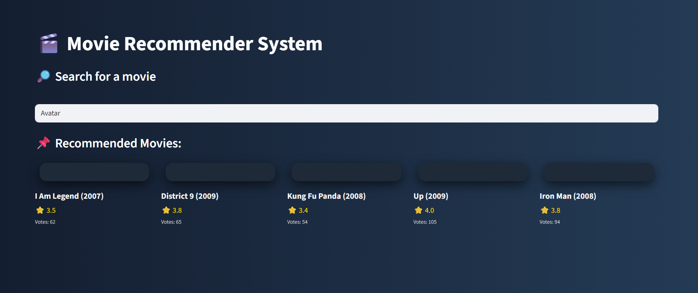
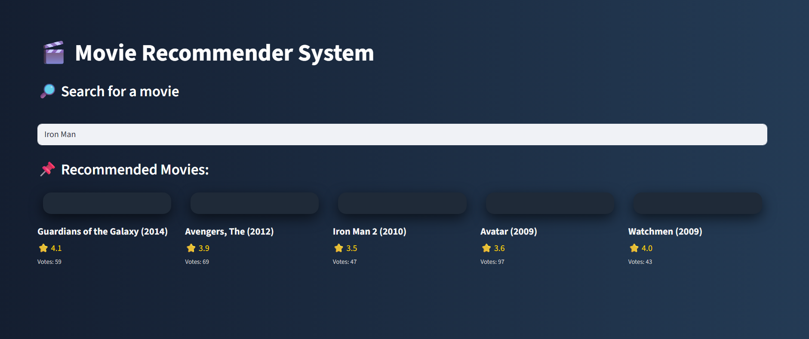

🎬 Movie Recommender System

This project is a content-based movie recommender system built with Python, Scikit-learn, and Streamlit.
It recommends similar movies based on cosine similarity of user ratings.

## 🚀 Features

Search for any movie from the dataset.

Get top 5 recommended movies based on similarity.

Displays movie title, average rating, and number of votes.

Built with a modern Streamlit UI (dark theme + styled movie cards).

## 🧑‍💻 How It Works

Data is loaded from movies.csv and ratings.csv.

Ratings are pivoted into a user × movie matrix.

Movies with very few ratings are filtered out.

The matrix is converted into a CSR sparse matrix.

A KNN model (cosine similarity, brute-force) is trained.

When you enter a movie title, the system:

Finds the movie in the dataset

Retrieves its vector index

Returns the top 5 most similar movies with their average ratings & votes

## Requirements

Python 3.8+

Pandas

NumPy

Scikit-learn

SciPy

Streamlit

## 📸 Screenshots

Here are some sample results from the Movie Recommender System:

### 🎬 Example 1

### 🎬 Example 2

### 🎬 Example 3
